# Fusion 整体架构图

## 一核九端 · 本地 AI 生态全景

```mermaid
graph TB
    subgraph Core["⚡ 核心层 — Fusion Core"]
        MLX["fusion-mlx
        ─────────────────
        Apple Silicon MLX 推理引擎
        Metal/ANE 加速 · KV Cache
        40+ 量化格式 · 连续批处理"]
    end

    subgraph Entry["🚪 统一入口层 — Entry Point"]
        CLI["fusion-cli
        ─────────────────
        Rust 单体二进制
        chat / run / embed / bench
        model / kb / service / desk"]
    end

    subgraph Platform["📦 平台能力层 — Platform"]
        MODEL_HUB["fusion-model-hub
        ─────────────────
        模型管理 · 下载/转换/注册
        多仓库源 · 元数据索引"]
        KB["fusion-kb
        ─────────────────
        知识库管理
        文档解析 · 向量存储
        RAG 检索 · 重排序"]
        BENCH["fusion-bench
        ─────────────────
        基准测试套件
        速度/内存/上下文压力
        自动参数优化"]
        PLUGINS["fusion-plugins-ecosystem
        ─────────────────
        插件注册中心
        MCP 导出器 · Claude 适配器
        令牌计量 · 生命周期管理"]
    end

    subgraph Application["🛠️ 应用工具层 — Application"]
        CODER["fusion-coder
        ─────────────────
        AI 编程助手
        Claude Code 兼容
        CLI + TUI + VSCode"]
        AGENT_STUDIO["fusion-agent-studio
        ─────────────────
        Agent 工作流编排
        状态机 · 图执行器
        19+ 内置工具 · 调试器"]
        DESK["fusion-desk
        ─────────────────
        桌面自动化平台
        零代码 · AI 语义
        工作流模板 · 定时任务"]
        DOC["fusion-doc
        ─────────────────
        文档管理平台
        基于 docmost 增强
        RAG 知识库集成"]
        DESIGN["fusion-design
        ─────────────────
        AI 可视化设计工作台
        OpenPencil(Rust) 底座
        对话式 UI 设计生成"]
    end

    subgraph Domain["🏭 行业垂直域 — Domain"]
        CODE_MODEL["fusion-code-modelization
        ─────────────────
        代码建模 · 分析/迁移/重构
        文档生成 · 安全扫描
        PR 生成 · 测试生成"]
        SECURITY["fusion-security
        ─────────────────
        代码安全审计
        AI 漏洞分析
        规则引擎 · 修复生成"]
        SCIENCE["fusion-science
        ─────────────────
        科学计算平台
        生物信息学 · 文献检索
        HPC 调度 · 可视化"]
        FINANCE["fusion-finance
        ─────────────────
        金融分析
        财务建模 · 风险评估
        投资组合 · 报表"]
        HEALTH["fusion-health
        ─────────────────
        医疗健康
        EHR 处理 · 保险编码
        文献检索 · 合规"]
        SIMULATION["fusion-simulation
        ─────────────────
        仿真环境
        数据管理 · 训练/评估
        AI 仿真引擎"]
        MATH["fusion-k12-teacher
        ─────────────────
        智能教育
        课程生成 · 个性化学习
        自动评阅 · 学科专家"]
        MULTI_NODES["fusion-multi-nodes
        ─────────────────
        分布式计算
        多节点 MLX 推理
        KV 缓存共享 · 集群管理"]
    end

    subgraph Infra["🔌 基础设施 — Infrastructure"]
        SERVER["服务进程管理
        process_manager · mcp_gateway"]
        STORE["数据存储
        SQLite · 向量数据库
        文件系统 · 对象存储"]
        WEB["Web 界面
        WKWebView · SwiftUI
        Vite · React"]
    end

    %% 核心连接关系
    CLI --> MLX
    CLI --> MODEL_HUB
    CLI --> KB
    CLI --> BENCH
    CLI --> DESK
    CLI --> DOC

    AGENT_STUDIO --> MLX
    CODER --> MLX
    DESK --> MLX
    DESIGN --> MLX

    KB --> MLX
    DOC --> KB

    CODER --> MODEL_HUB
    AGENT_STUDIO --> MODEL_HUB

    CODER --> KB
    DESK --> KB

    AGENT_STUDIO --> PLUGINS

    SECURITY --> CODER
    CODE_MODEL --> CODER

    SCIENCE --> MLX
    FINANCE --> MLX
    HEALTH --> MLX
    MATH --> MLX
    SIMULATION --> MLX
    MULTI_NODES --> MLX

    SCIENCE --> KB
    FINANCE --> KB
    HEALTH --> KB

    SCIENCE --> BENCH
    SIMULATION --> BENCH

    MULTI_NODES --> MODEL_HUB

    %% 基础设施连接
    AGENT_STUDIO --> SERVER
    DESK --> SERVER
    CODER --> SERVER

    AGENT_STUDIO --> STORE
    KB --> STORE
    DOC --> STORE

    DESK --> WEB
    DESIGN --> WEB
    DOC --> WEB

    %% 样式定义
    classDef core fill:#ff6b35,color:#fff,stroke:#ff6b35,stroke-width:2px
    classDef entry fill:#7c3aed,color:#fff,stroke:#7c3aed,stroke-width:2px
    classDef platform fill:#0891b2,color:#fff,stroke:#0891b2,stroke-width:2px
    classDef app fill:#059669,color:#fff,stroke:#059669,stroke-width:2px
    classDef domain fill:#d97706,color:#fff,stroke:#d97706,stroke-width:2px
    classDef infra fill:#6b7280,color:#fff,stroke:#6b7280,stroke-width:2px

    class MLX core
    class CLI entry
    class MODEL_HUB,KB,BENCH,PLUGINS platform
    class CODER,AGENT_STUDIO,DESK,DOC,DESIGN app
    class CODE_MODEL,SECURITY,SCIENCE,FINANCE,HEALTH,SIMULATION,MATH,MULTI_NODES domain
    class SERVER,STORE,WEB infra
```

## 分层说明

| 层级 | 说明 | 技术栈 |
|------|------|--------|
| **⚡ 核心层** | fusion-mlx 推理引擎，所有 AI 能力的基座 | MLX (Apple), Metal, Python |
| **🚪 统一入口层** | fusion-cli 单二进制命令行入口，控制所有模块 | Rust (clap), HTTP |
| **📦 平台能力层** | 模型管理、知识库、基准测试、插件系统等基础能力 | Python, FastAPI, SQLite, Chroma |
| **🛠️ 应用工具层** | 编程助手、Agent 工作流、桌面自动化、文档、设计 | Python, Rust, SwiftUI, React |
| **🏭 行业垂直域** | 金融、医疗、科学、教育、安全等垂直领域应用 | Python, 各领域专用库 |
| **🔌 基础设施** | 服务管理、数据存储、Web 界面 | SQLite, Vector DB, WKWebView |

## 核心设计原则

- **🔒 100% 本地离线** — 无云端 API、无遥测、无数据离开设备
- **🍎 Apple Silicon 原生** — MLX 硬件加速，M1-M5 全系优化
- **🔗 全生态打通** — 模块间通过 CLI + HTTP API 无缝集成
- **📦 单二进制入口** — fusion-cli 统一管理所有服务和命令