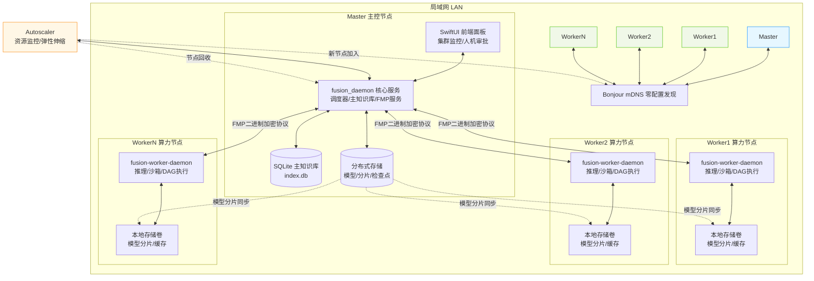
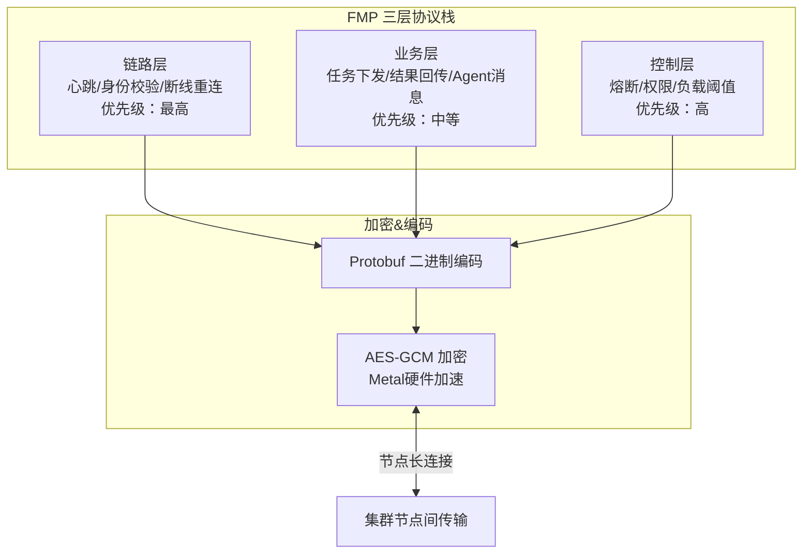
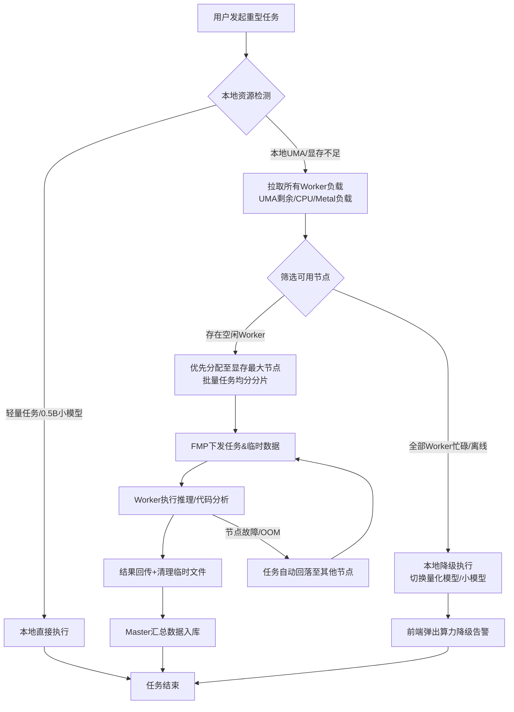
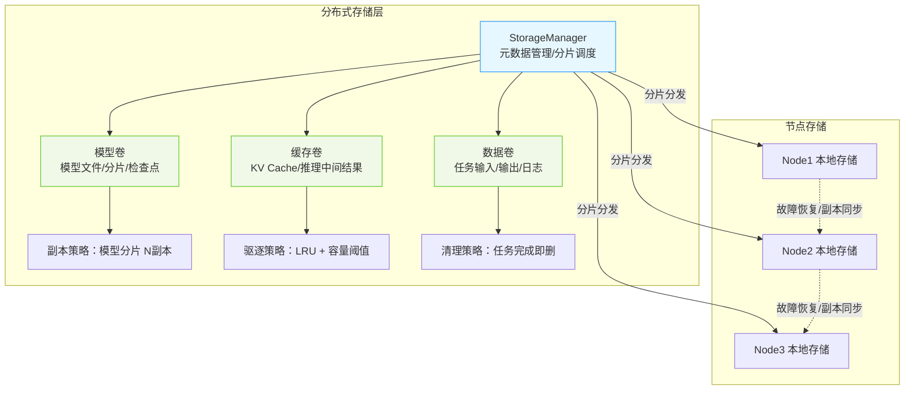
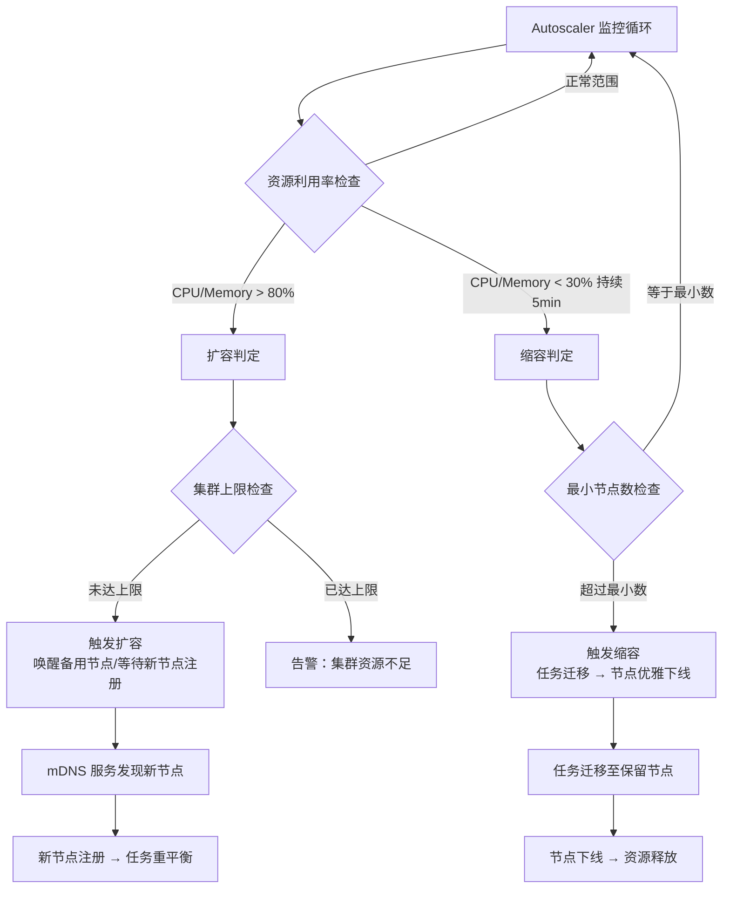

# Fusion-Multi-Node 集群模块 架构图+开发任务清单

> 配套文档：Fusion-Multi-Node PRD v1.0
> 适用角色：后端开发、前端开发、测试、项目管理
> 文档格式：标准 Markdown，可直接提交至 Git / 项目管理平台

---

## 一、集群架构可视化（Mermaid 图表）

### 1.1 整体集群拓扑图

### 1.2 FMP 三层协议栈通信图

### 1.3 负载感知任务调度流程图

### 1.4 分布式存储架构图

### 1.5 扩缩容流程图

---

## 二、迭代总览规划

| 迭代阶段 | 周期 | 核心范围 | 负责小组 |
|---|---|---|---|
| Sprint1 | 第 1-2 周 | mDNS 节点发现 + FMP 基础通信协议 | 协议组、集群开发组 |
| Sprint2 | 第 3-4 周 | 节点角色管理 + LiteLLM 负载调度 + 分布式存储 | 集群开发组、模型网关组 |
| Sprint3 | 第 5-6 周 | 任务分片管理 + 集群安全权限 + 扩缩容 | 集群开发组、安全沙箱组 |
| Sprint4 | 第 7-8 周 | 前端可视化面板 + 全流程联调 + 测试 | 前端 UI 组、全组联调 |

> 优先级说明：
> - P0：MVP 核心必做，缺失则模块不可用
> - P1：MVP 重要功能，纳入正式发布
> - P2：优化类功能，版本迭代延后实现

---

## 三、分模块开发任务清单

### 模块 1：mDNS 零配置节点发现（P0 | Sprint1 | 归属：集群开发组）

| 任务 ID | 任务名称 | 优先级 | 任务描述 | 验收标准 |
|---|---|---|---|---|
| M1-01 | mDNS 服务注册 | P0 | 基于 Bonjour 实现服务广播，固定服务标识 `_fusionmlx._tcp.local.` | 节点启动自动注册，仅同局域网设备可见 |
| M1-02 | 节点广播报文结构 | P0 | 报文包含：设备型号、UMA 大小、IP、端口、节点角色 | 字段完整，跨节点可正常解析 |
| M1-03 | 心跳机制实现 | P0 | 节点每 3s 上报心跳；连续 15s 无心跳标记为离线 | 心跳稳定，离线状态 5s 内同步更新 |
| M1-04 | 非法设备过滤 | P0 | 过滤非本项目 mDNS 服务，拒绝纳入集群 | 局域网其他设备不会被识别为集群节点 |
| M1-05 | 手动 IP 兜底接入 | P0 | mDNS 异常时，支持手动输入 IP 完成组网 | 手动 IP 可正常连通、加入集群 |

---

### 模块 2：FMP 自研二进制通信协议（P0 | Sprint1 | 归属：协议组）

| 任务 ID | 任务名称 | 优先级 | 任务描述 | 验收标准 |
|---|---|---|---|---|
| M2-01 | Protobuf 三层结构定义 | P0 | 完成链路层、业务层、控制层 proto 结构体编写 | 序列化/反序列化正常无报错 |
| M2-02 | AES-GCM 加密封装 | P0 | 全报文强制加密，启用 Metal 硬件加速 | 抓包无明文，加解密无明显性能卡顿 |
| M2-03 | 节点长连接管理 | P0 | 节点间维持 TCP 长连接，断线自动重连 | 网络恢复后 3s 内完成重连 |
| M2-04 | 消息转发次数限制 | P0 | 跨节点消息 `hop_count ≤ 3`，超限直接拦截；与 FMP 多轮对话 `MAX_ROUNDS` 分离，`hop_count` 控制物理转发跳数，`MAX_ROUNDS` 控制逻辑对话轮次 | 杜绝消息循环转发、广播风暴；两维度独立可配 |
| M2-05 | 统一收发接口封装 | P0 | 封装通用发送/接收 API，向上层提供调用能力 | 上层业务可无感调用 FMP 通信能力 |

---

### 模块 3：节点角色与状态管理（P0 | Sprint2 | 归属：集群开发组）

| 任务 ID | 任务名称 | 优先级 | 任务描述 | 验收标准 |
|---|---|---|---|---|
| M3-01 | Master/Worker 权限隔离 | P0 | Master 持有主库、调度、审批权限；Worker 仅负责任务执行 | Worker 无法读写主知识库与 Agent 记忆文件 |
| M3-02 | 节点状态机 | P0 | 状态枚举：在线、忙碌、离线、故障；NodeInfo 增加 `role` 字段（master/worker/stby） | 状态切换准确，全集群实时同步；角色字段可区分节点职责 |
| M3-03 | Master 选举机制 | P0 | 默认首个启动节点为 Master，支持手动切换主控节点 | 自动选举、手动变更均可正常生效 |
| M3-04 | 集群节点列表维护 | P0 | Master 统一维护全局节点清单 | 节点上下线列表实时刷新 |
| M3-05 | TaskSpec 数据类 | P0 | 定义 `TaskSpec` dataclass：model_name、input_tokens、output_tokens、timeout、priority、required_capability、memory_requirement | 任务提交具备结构化描述，调度可按 spec 精确匹配 |

---

### 模块 4：LiteLLM 负载感知调度（P0 | Sprint2 | 归属：集群组 + 模型网关组）

| 任务 ID | 任务名称 | 优先级 | 任务描述 | 验收标准 |
|---|---|---|---|---|
| M4-01 | 负载指标采集 | P0 | 定时采集：UMA 剩余、CPU、Metal 负载、任务队列长度；结构化指标：`LoadMetrics(uma_used_ratio, cpu_percent, metal_util, task_queue_len, net_rtt_ms)` | 1s/次采集，数据真实准确；指标结构化可序列化 |
| M4-02 | 本地优先调度规则 | P0 | 轻量任务、0.5B 门控模型强制本地执行 | 小型任务不会下发至 Worker 节点 |
| M4-03 | 大模型推理调度 | P0 | 优先分配至剩余显存最大的空闲 Worker | 本地 OOM 时 1s 内完成任务分流 |
| M4-04 | 任务自动降级 | P0 | Worker 故障/无可用节点时，任务回落本机并前端告警 | 故障切换耗时 ≤ 2s，任务不中断 |
| M4-05 | 云端 API 兜底联动 | P1 | 集群无算力时，LiteLLM 自动切换云端 LLM | 本地集群不可用时无感切换 |

---

### 模块 5：任务分片与生命周期管理（P1 | Sprint3 | 归属：集群开发组）

| 任务 ID | 任务名称 | 优先级 | 任务描述 | 验收标准 |
|---|---|---|---|---|
| M5-01 | 可分片任务类型定义 | P1 | 支持：大模型推理、AST 批量解析、知识库向量化 | 指定类型可正常拆分执行 |
| M5-02 | 自动分片算法 | P1 | 按文件/文档/批次均分，支持默认粒度配置 | 批量任务均匀分发至多节点 |
| M5-03 | 超时与重试机制 | P1 | 任务默认超时 300s，自动重试 1 次，失败标记告警 | 超时任务自动重试，不阻塞队列 |
| M5-04 | 任务全链路取消 | P1 | 前端手动取消任务，所有节点同步停止执行 | 取消指令下发后 1s 内释放资源 |
| M5-05 | 分片结果汇总合并 | P1 | Master 统一收集、拼接多分片结果并入库 | 结果完整无丢失、无错乱 |

---

### 模块 6：集群安全与权限管控（P1 | Sprint3 | 归属：安全沙箱组）

| 任务 ID | 任务名称 | 优先级 | 任务描述 | 验收标准 |
|---|---|---|---|---|
| M6-01 | 核心数据隔离 | P1 | 主库、人设、记忆仅存 Master；Worker 临时数据执行后立即删除 | Worker 无法持久化核心业务数据 |
| M6-02 | Worker 沙箱强隔离 | P1 | 禁止外网访问、sudo 命令、系统目录读写；选择沙箱技术（Docker / sandbox-exec / seatbelt），明确选型与理由 | 沙箱内代码无法越权访问系统资源；技术选型有文档支撑 |
| M6-03 | 新节点接入审批 | P1 | 陌生节点接入集群需 Master 手动确认 | 未审批节点无法加入集群 |
| M6-04 | 传输数据裁剪 | P1 | 跨节点仅传输 AST 差分、摘要，不传输完整源码 | 敏感代码不对外明文传输 |

---

### 模块 7：前端集群可视化面板（P1 | Sprint4 | 归属：前端 UI 组）

| 任务 ID | 任务名称 | 优先级 | 任务描述 | 验收标准 |
|---|---|---|---|---|
| M7-01 | 集群总览面板 | P1 | 展示节点列表、角色、负载、运行状态 | 数据 1s 刷新，不同状态颜色区分 |
| M7-02 | 集群拓扑图 | P1 | 图形化展示 Master 与 Worker 连接关系 | 拓扑直观，节点状态联动变色 |
| M7-03 | 任务监控面板 | P1 | 展示任务 ID、分片数、执行进度、运行节点 | 进度实时展示，分片状态清晰可见 |
| M7-04 | 节点操作入口 | P1 | 支持移除节点、重启 Worker、手动调度任务 | 前端操作可同步生效至集群后端 |
| M7-05 | 异常告警通知 | P1 | 节点离线、OOM、任务失败触发弹窗+系统通知 | 异常 5s 内推送提示，故障描述明确 |
| M7-06 | 监控 API 定义 | P1 | 定义 `/api/v1/cluster/stats`、`/api/v1/nodes/{id}/metrics`、`/api/v1/tasks/{id}/progress` 等 RESTful 端点，OpenAPI 3.0 spec | 前后端契约明确，API 文档可自动生成 |

---

### 模块 8：日志与故障排查（P2 | 后续迭代 | 归属：全组）

| 任务 ID | 任务名称 | 优先级 | 任务描述 | 验收标准 |
|---|---|---|---|---|
| M8-01 | 分级日志收集 | P2 | 日志分级：INFO/WARN/ERROR/FATAL，Master 汇总全节点日志 | 日志分级正常，支持按节点、级别筛选 |
| M8-02 | 日志存储与导出 | P2 | 本地日志保留 7 天，支持一键导出备份 | 日志可正常查询、本地导出 |
| M8-03 | 故障智能提示 | P2 | 基于日志自动识别故障，并给出优化建议 | 故障定位准确，提示文案易懂可用 |

---

### 模块 9：分布式存储（P1 | Sprint2-3 | 归属：集群开发组）

| 任务 ID | 任务名称 | 优先级 | 任务描述 | 验收标准 |
|---|---|---|---|---|
| M9-01 | 存储卷抽象 | P1 | 定义 StorageVolume 抽象：模型卷（只读，多副本）、缓存卷（读写，LRU 驱逐）、数据卷（读写，任务生命周期绑定） | 三种卷类型可独立管理，接口统一 |
| M9-02 | 模型分片分发 | P1 | Master 持有完整模型，按 pipeline/data 并行策略将分片推送至 Worker 本地存储 | 分片分发准确，Worker 可加载本地分片启动推理 |
| M9-03 | 分片副本与恢复 | P1 | 模型分片 N 副本（默认 2），节点故障时从副本节点恢复至新节点 | 单节点故障不导致分片丢失，恢复时间 < 30s |
| M9-04 | KV Cache 分布式存储 | P1 | 节点 KV Cache 按前缀匹配跨节点共享，远程查询通过 FMP 传输 | 跨节点 KV 复用命中率 > 60%（同 prompt 场景） |
| M9-05 | 存储容量监控与驱逐 | P1 | 节点存储使用率超阈值自动驱逐低优先级缓存；模型卷不可驱逐 | 存储使用率告警准确，驱逐不影响运行中任务 |
| M9-06 | 检查点持久化 | P1 | 推理任务检查点写入分布式存储，支持断点续推 | 任务中断后可从最近检查点恢复 |

---

### 模块 10：弹性扩缩容（P1 | Sprint3 | 归属：集群开发组）

| 任务 ID | 任务名称 | 优先级 | 任务描述 | 验收标准 |
|---|---|---|---|---|
| M10-01 | Autoscaler 核心循环 | P1 | 定时采集集群资源利用率（CPU/Memory/GPU），判定扩缩容 | 判定逻辑可配置阈值，无震荡 |
| M10-02 | 扩容流程 | P1 | 资源不足时唤醒备用节点或等待新节点注册；新节点完成健康检查后自动纳入调度 | 扩容后新节点 10s 内可接收任务 |
| M10-03 | 缩容流程 | P1 | 资源空闲持续 N 分钟后，迁移任务至保留节点，优雅下线空闲节点 | 缩容不丢失运行中任务，节点优雅退出 |
| M10-04 | 扩缩容策略配置 | P1 | 支持配置：最小/最大节点数、扩容阈值、缩容冷却时间、缩容等待窗口 | 策略变更热更新，无需重启集群 |
| M10-05 | 任务重平衡 | P1 | 扩缩容后触发全局任务重平衡，按节点评分重新分配 | 重平衡后集群负载方差下降 > 30% |

---

## 四、依赖清单与 Gap 分析

### 4.1 核心依赖

| 依赖 | 版本 | 用途 | 状态 |
|---|---|---|---|
| zeroconf | >= 0.131 | mDNS 服务发现 | pyproject.toml 已声明（optional: mdns） |
| httpx | >= 0.28 | 节点间 HTTP 通信 | pyproject.toml 已声明 |
| psutil | >= 7.0 | 硬件信息采集 | pyproject.toml 已声明 |
| click | >= 8.2 | CLI 框架 | pyproject.toml 已声明 |
| protobuf | >= 5.0 | FMP 二进制编码 | **未添加** |
| cryptography | >= 44.0 | AES-GCM 加密 | **未添加** |
| fastapi + uvicorn | >= 0.115 | 监控 API / Web 面板 | pyproject.toml 已声明（optional: web） |

### 4.2 实现缺口（Gap Analysis）

| 模块 | 已实现 | 未实现 | 差距评估 |
|---|---|---|---|
| FMP 协议 | FMPMessage dataclass（JSON 序列化） | Protobuf 定义、AES-GCM 加密、TCP 长连接 | 核心缺失，Sprint1 阻塞项 |
| mDNS 发现 | NodeDiscovery 类（内存注册表） | zeroconf 集成、Bonjour 广播 | 需替换为真实 mDNS |
| 负载调度 | LoadRouter + NodeInfo.score | 结构化 LoadMetrics、本地优先策略 | 部分缺失 |
| 任务分片 | ClusterTask dataclass | TaskSpec、分片算法、结果合并 | 部分缺失 |
| 安全沙箱 | 无 | 沙箱技术选型与实现 | 完全缺失 |
| 分布式存储 | KVSharingManager（内存 KV） | StorageVolume、模型分片分发、副本恢复 | 大部分缺失 |
| 扩缩容 | 无 | Autoscaler 核心循环、扩缩容策略 | 完全缺失 |
| 监控 API | ClusterObservability（内存指标） | RESTful 端点、OpenAPI spec | 部分缺失 |

### 4.3 Sprint 风险与缓解

| 风险 | 影响 | 缓解措施 |
|---|---|---|
| Protobuf + AES-GCM 性能不达预期 | FMP 延迟增大 | Sprint1 第 1 周完成 POC 基准测试；备选：FlatBuffers |
| mDNS 跨网段不可用 | 节点发现受限 | M1-05 手动 IP 兜底；备选：UDP 广播 + 配置文件 |
| 分布式存储一致性 | 分片丢失/损坏 | 副本策略 + 校验和；Sprint2 先做单副本 MVP |
| 扩缩容震荡 | 节点频繁加入/退出 | 缩容冷却窗口 5min + 最小节点数保底 |
| 沙箱技术选型 | macOS sandbox-exec 限制 | Sprint3 第 1 周完成技术调研；备选：Docker Desktop |

---

## 五、开发红线（代码评审强制门禁）

1. mDNS、FMP 服务**仅开放局域网**，禁止对公网暴露端口与服务；
2. 所有跨节点通信必须使用 `FMP + AES-GCM` 加密，严禁明文传输；
3. SQLite 主知识库、`soul.md`、`memory.md` 仅保留在 Master，禁止同步至 Worker；
4. 轻量任务、小模型推理强制本地执行，不允许下发集群；
5. 跨节点消息转发 `hop_count` 严格限制 ≤ 3，代码层面强制校验；`hop_count` 与 FMP 多轮对话 `MAX_ROUNDS` 是独立维度，不得混淆；
6. Worker 沙箱默认阻断外网、高危系统调用，权限遵循最小可用原则；
7. 分布式存储：模型卷为只读，禁止 Worker 自行修改；缓存卷驱逐不得影响运行中任务；
8. 扩缩容：缩容必须完成任务迁移后才可下线节点，禁止强制断开。

---

## 六、文档交付清单

1. 五张 Mermaid 架构图表（拓扑、协议栈、调度流程、分布式存储、扩缩容）
2. 四阶段迭代规划表
3. 全模块结构化开发任务清单（含 ID、优先级、验收标准）
4. 依赖清单与 Gap 分析表
5. 开发强制红线规范（用于代码评审）

> （注：部分内容可能由 AI 生成）
